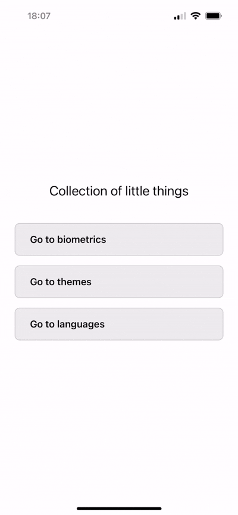
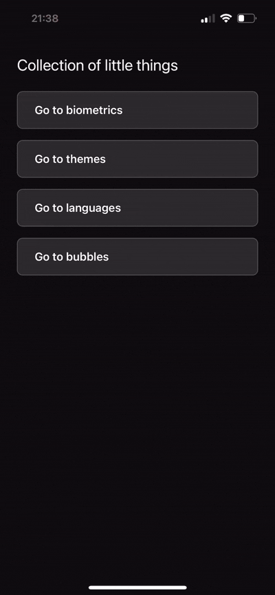
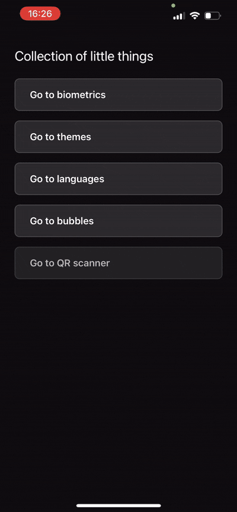

# Collection of Little Things

## 📱 About the project

This is a small pet project to showcase different pieces of functionality and my React Native workflow. I experiment with UI, navigation, state management, and tooling that I actually use in real projects.

## ✨ What you can see in the app

### 🔐 Biometric authentication
- Touch ID and Face ID support
- Alternative login with a 4‑digit PIN code
- Swipe-up gesture for quick biometric authentication
- Animated transitions and interactive UI

### 🫧 Bubbles game
- **Interactive bubble popping game** – tap bubbles to pop them
- **Customizable count** – choose number of bubbles (1–20) with form validation
- **Smooth animations** – bubbles float around the screen with continuous movement
- **Pop animation** – bubbles expand and fade when tapped
- **Form validation** – input validation using `react-hook-form` and `yup`
- **Reusable components** – `ControlledInput` for form fields, `Bubble` component for game elements
- **Game completion** – congratulatory message when all bubbles are popped

### 📷 QR Scanner
- **Real-time QR code scanning** – scan QR codes using device camera
- **Camera permissions** – permission request
- **Result modal** – displays scanned data in a modal with actions
- **URL detection** – automatically detects if scanned data is a valid URL
- **Open links** – one-tap to open URLs in default browser
- **Copy to clipboard** – copy scanned data with a single tap

### 🎨 UI/UX
- **Theme system** – three visual themes (Dark, Light, Toxic)
- Custom components (Button, Alert, Keypad, PasscodeInput)
- Smooth animations and transitions
- Adaptive layout with Safe Area support

### 🎨 Theme system
- **Three themes**:
  - **Dark** – classic dark theme with light text
  - **Light** – light theme with dark text
  - **Toxic** – neon theme with bright colors (#00ff41, #ff00ff, #00ffff)
- **Instant switching** – theme is applied to the whole app immediately
- **Centralized config** – all colors live in `themes.ts` with proper typing
- **Type-safe** – strong typing for theme keys

### 🌍 Language switching
- **Three interface languages**: Russian, English, German
- **Languages screen** – dedicated screen to choose the language
- **Language persistence** – selection stored via Zustand + AsyncStorage
- **Custom i18n** – key-based dictionary and `useTranslation` hook for text localization

### 🏗️ Architecture & code
- **Feature-based structure** – code organized by features
- **Separation of concerns** – logic extracted into custom hooks
- **Reusable components** – modular UI
- **TypeScript** – full typing for safer code
- **Import aliases** – clean import paths (`@components`, `@features`, `@navigation`)
- **Zustand + AsyncStorage** – lightweight global state manager with persistence

### 🛠️ Developer tooling
- **ESLint + Prettier** – auto-formatting and linting
- **Husky + lint-staged** – pre-commit hooks for code quality
- **Theme management** – Zustand store + `useTheme` hook
- **Screen dimensions constants** – helpers for adaptive layout

## 📸 Screenshots

### Biometrics


### Themes


### Languages


### Bubbles (Animations)


### QR scanner


## 🚀 Getting started

### Requirements

- Node.js >= 18
- Yarn 3.6.4
- React Native CLI
- For iOS: Xcode and CocoaPods
- For Android: Android Studio and Android SDK

### Install dependencies

```bash
# Install JS dependencies
yarn install
```

### Run on iOS

```bash
# Install CocoaPods dependencies (first run only)
cd ios
bundle install
bundle exec pod install
cd ..

# Run the app on iOS simulator / device
yarn ios
```

### Run on Android

```bash
# Make sure Android emulator is running or device is connected
yarn android
```

### Metro bundler

```bash
# Run Metro bundler
yarn start

# With cache reset (if something is broken)
yarn start --reset-cache
```

## 📦 Tech stack

- **React Native 0.80.2** – mobile framework
- **React Navigation 7** – navigation between screens
- **TypeScript** – typed JavaScript
- **react-native-biometrics** – biometric authentication
- **react-native-vision-camera** – camera access and QR code scanning
- **react-native-permissions** – runtime permission handling
- **react-native-gesture-handler** – gesture handling
- **react-hook-form** – form state management and validation
- **yup** – schema validation
- **@hookform/resolvers** – validation resolvers for react-hook-form
- **Zustand** – global state management
- **@react-native-async-storage/async-storage** – data storage
- **@react-native-clipboard/clipboard** – clipboard operations
- **ESLint + Prettier** – linting and formatting
- **Husky** – Git hooks

## 📁 Project structure

```
src/
├── components/              # Reusable UI components
│   ├── Alert/               # Custom Alert component with service
│   ├── Button/              # Generic button
│   ├── ControlledInput/     # Form input with react-hook-form integration
│   ├── Modal/               # Custom Modal component
│   └── Toast/               # Toast notifications with service
├── constants/               # App constants
│   ├── languages.ts         # Available languages configuration
│   ├── screenDimensions.ts  # Screen dimensions helpers
│   ├── themes.ts            # Theme system (Dark, Light, Toxic)
│   └── translations.ts      # Translation keys
├── features/                # Feature modules
│   ├── biometrics/          # Biometric auth flow
│   │   ├── components/      # Keypad, PasscodeInput
│   │   └── screens/         # HomeScreen, PasswordScreen
│   ├── bubbles/             # Bubbles game
│   │   ├── components/      # Bubble component
│   │   ├── screens/         # BubblesCountScreen, BubblesScreen
│   │   └── schemas/         # Form validation schemas
│   ├── languages/           # Language selection
│   │   ├── components/      # LanguageItem
│   │   └── screens/         # LanguagesScreen
│   ├── main/                # Landing and entry screens
│   │   └── screens/         # LandingScreen
│   ├── qrscanner/           # QR code scanner
│   │   ├── components/      # QRResultModal, ScanOverlay
│   │   └── screens/         # QRScannerScreen
│   └── themes/              # Theme selection
│       ├── constants/       # Theme constants
│       └── screens/         # ThemesScreen
├── hooks/                   # Custom hooks
│   ├── useTheme.ts          # Theme hook (Zustand-powered)
│   └── useTranslation.ts    # Translation hook 
├── navigation/              # App navigation
│   ├── BiometricNavigator/  # Biometric feature navigation
│   ├── BubblesNavigator/    # Bubbles game navigation
│   └── RootNavigator/       # Root navigation stack
├── store/                   # Zustand stores
│   ├── languageStore.ts     # Language state management
│   └── themeStore.ts        # Theme state management
└── utils/                   # Utility functions
    └── permissions.ts       # Permission handling helper
```

## 🎯 Implementation details

- **Custom hooks** – business logic extracted into dedicated hooks (e.g., `useBubblesScreen`)
- **Component composition** – UI split into small reusable pieces
- **Form management** – `react-hook-form` with `yup` validation schemas
- **Animation system** – React Native `Animated` API for smooth animations
- **Type safety** – full typing for navigation and props
- **Theme system** – centralized theme config with types
- **Zustand** – global store for app-wide state
- **Code quality** – automated checks before commit
- **Clean code** – consistent style and structure

## 📝 Scripts

```bash
yarn start      # Start Metro bundler
yarn android    # Run Android app
yarn ios        # Run iOS app
yarn lint       # Run ESLint
```

## 📄 License

This is a personal pet project for portfolio purposes.
