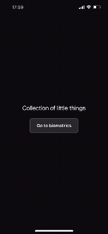
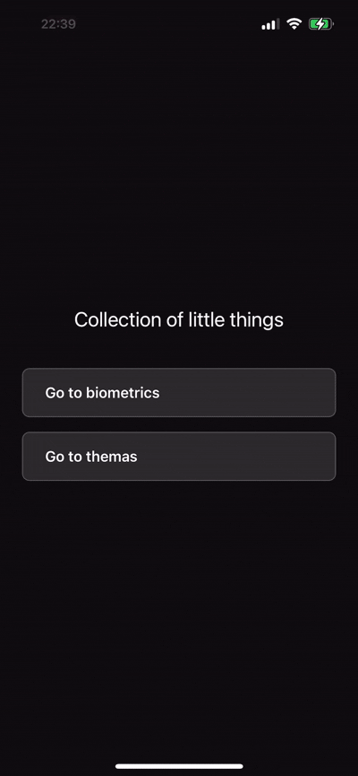

# Collection of Little Things

## 📱 О проекте

Проект создан развлечения ради. Здесь я показываю часть своих навыков разработки и экспериментирую с различными подходами в React Native.

## ✨ Что можно увидеть в проекте

### 🔐 Биометрическая аутентификация
- Поддержка Touch ID и Face ID
- Альтернативный вход через PIN-код (4 цифры)
- Swipe-up жесты для быстрой биометрической аутентификации
- Анимированные переходы и интерактивные элементы

### 🎨 UI/UX решения
- **Система тем** - три темы оформления (Dark, Light, Toxic)
- Кастомные компоненты (Button, Alert, Keypad, PasscodeInput)
- Плавные анимации и переходы
- Адаптивный дизайн с поддержкой Safe Area

### 🎨 Система тем
- **Три темы оформления**:
  - **Dark** - классическая темная тема с белым текстом
  - **Light** - светлая тема с темным текстом
  - **Toxic** - неоновая тема с яркими цветами (#00ff41, #ff00ff, #00ffff)
- **Динамическое переключение** - тема применяется ко всему приложению мгновенно
- **Централизованное управление** - все цвета определены в `themes.ts` с типизацией
- **Type-safe** - использование типов для безопасности

### 🏗️ Архитектура и код
- **Feature-based структура** - код организован по функциональным модулям
- **Разделение логики и представления** - использование custom hooks
- **Переиспользуемые компоненты** - модульная архитектура
- **TypeScript** - полная типизация для надежности кода
- **Алиасы импортов** - чистые и читаемые пути (`@components`, `@features`, `@navigation`)
- **Zustand + AsyncStorage** - легковесный глобальный стейт менеджер с персистом

### 🛠️ Инструменты разработки
- **ESLint + Prettier** - автоматическое форматирование и проверка кода
- **Husky + lint-staged** - pre-commit хуки для качества кода
- **Система управления темами** - Zustand-стор + кастомный хук `useTheme`
- **Константы для размеров экрана** - адаптивность под разные устройства

## 📸 Скриншоты

### Biometrics


### Themes


## 🚀 Как запустить проект

### Требования

- Node.js >= 18
- Yarn 3.6.4
- React Native CLI
- Для iOS: Xcode и CocoaPods
- Для Android: Android Studio и Android SDK

### Установка зависимостей

```bash
# Установка зависимостей
yarn install
```

### Запуск на iOS

```bash
# Установка CocoaPods зависимостей (только первый раз)
cd ios
bundle install
bundle exec pod install
cd ..

# Запуск приложения
yarn ios
```

### Запуск на Android

```bash
# Убедитесь, что эмулятор Android запущен или устройство подключено
yarn android
```

### Запуск Metro Bundler

```bash
# Запуск Metro bundler отдельно
yarn start

# С очисткой кэша (если возникают проблемы)
yarn start --reset-cache
```

## 📦 Используемые технологии

- **React Native 0.80.2** - фреймворк для мобильной разработки
- **React Navigation 7** - навигация между экранами
- **TypeScript** - типизированный JavaScript
- **react-native-biometrics** - биометрическая аутентификация
- **react-native-gesture-handler** - обработка жестов
- **Zustand** - глобальное управление состоянием
- **@react-native-async-storage/async-storage** - хранилище данных
- **ESLint + Prettier** - линтинг и форматирование
- **Husky** - Git hooks

## 📁 Структура проекта

```
src/
├── components/          # Переиспользуемые компоненты
│   ├── Alert/         # Кастомный Alert компонент
│   └── Button/        # Универсальная кнопка
├── constants/           # Константы приложения
│   ├── themes.ts        # Система тем (Dark, Light, Toxic)
│   └── screenDimensions.ts  # Размеры экрана
├── features/          # Функциональные модули
│   ├── biometrics/    # Модуль биометрической аутентификации
│   ├── main/            # Главный модуль
│   └── themas/          # Модуль выбора тем
├── hooks/               # Кастомные хуки
│   └── useTheme.ts      # Хук работы с темами
├── store/               # Zustand сторы
│   └── themeStore.ts    # Стор для темы приложения
└── navigation/          # Навигация приложения
```

## 🎯 Особенности реализации

- **Custom Hooks** - бизнес-логика вынесена в отдельные хуки
- **Component Composition** - компоненты разбиты на мелкие переиспользуемые части
- **Type Safety** - полная типизация навигации и пропсов
- **Theme System** - централизованная система тем с типами
- **Zustand** - глобальный стор
- **Code Quality** - автоматические проверки перед коммитом
- **Clean Code** - следование принципам чистого кода

## 📝 Скрипты

```bash
yarn start      # Запуск Metro bundler
yarn android    # Запуск на Android
yarn ios        # Запуск на iOS
yarn lint       # Проверка кода ESLint
```

## 📄 Лицензия

Это pet-проект для портфолио.
